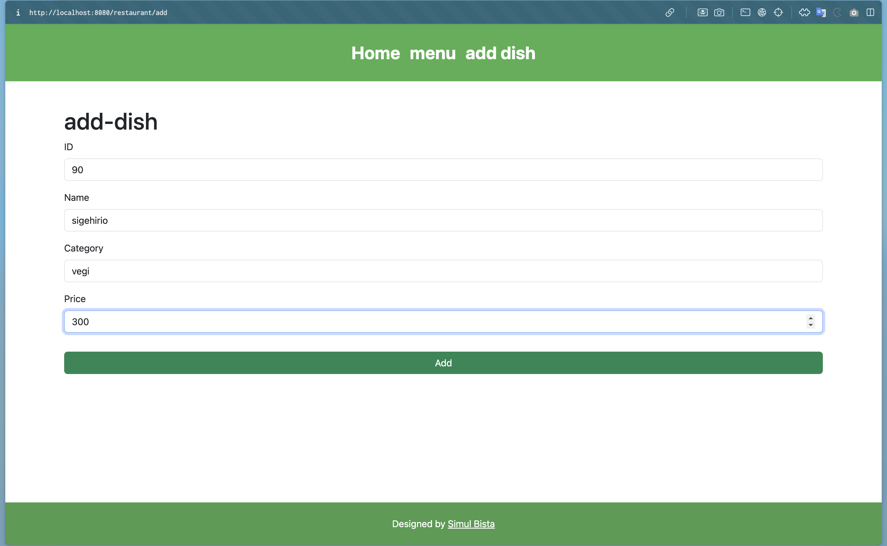
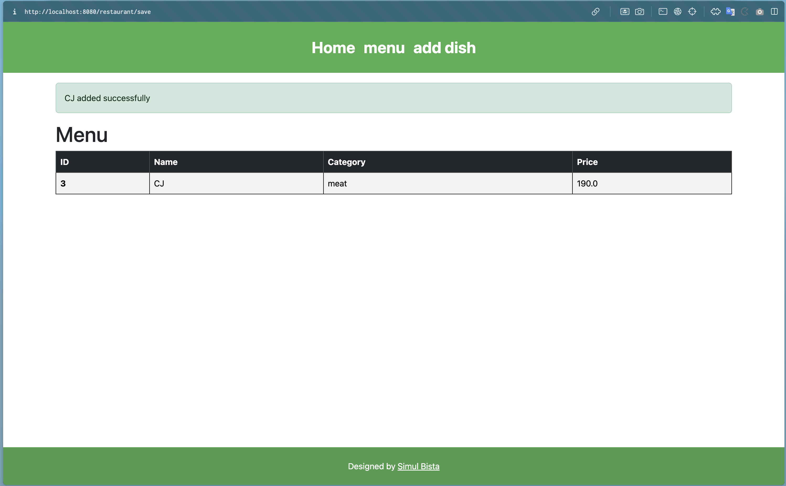
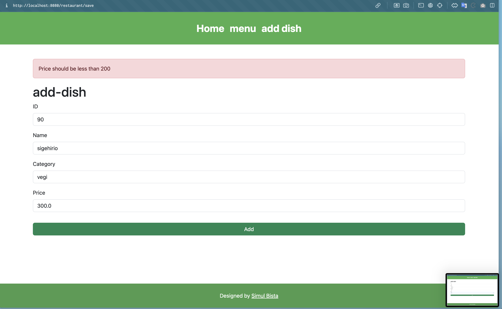

# Class Notes

In this session, we implemented the following code:

## Implementing the Submit Function with Form

- **POST**: Send form data to the server.
- **Transition to Menu Page**: Redirect to the menu page after submission.
- **Implement Validation**:
  - If the price is 200 or more, an error occurs.
  - If the price is less than 200, an alert is displayed after transitioning to the menu page.
- **Layout Adjustment**: Adjust the layout of the form.

## Images Used

